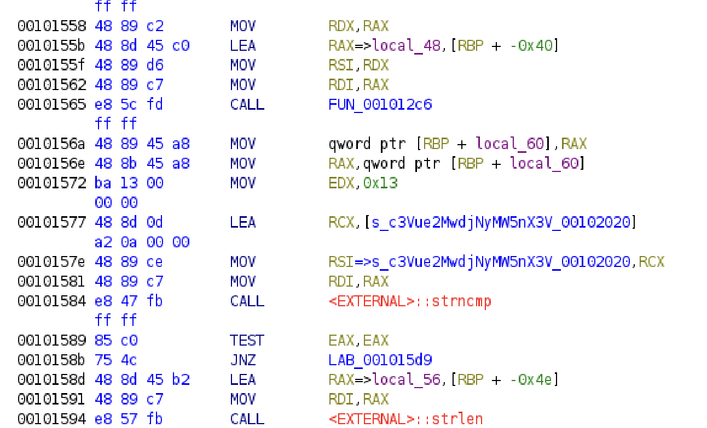

# BASEic

The space base is in danger and we lost the key to get in!

# Attempt

> file BASEic

```
BASEic: ELF 64-bit LSB pie executable, x86-64, version 1 (SYSV), dynamically linked, interpreter /lib64/ld-linux-x86-64.so.2, BuildID[sha1]=4c27a8522e5cde996407511f18c475d48dda4ea9, for GNU/Linux 3.2.0, stripped
```

> strings BASEic

```
/lib64/ld-linux-x86-64.so.2
__cxa_finalize
malloc
__libc_start_main
strncmp
puts
free
strlen
__isoc99_scanf
__stack_chk_fail
printf
libc.so.6
GLIBC_2.7
GLIBC_2.4
GLIBC_2.34
GLIBC_2.2.5
_ITM_deregisterTMCloneTable
__gmon_start__
_ITM_registerTMCloneTable
PTE1
u+UH
yX0I0NTMH
1fQ=f
c3Vue2MwdjNyMW5nX3V
ABCDEFGHIJKLMNOPQRSTUVWXYZabcdefghijklmnopqrstuvwxyz0123456789+/
What is the flag> 
%40s
You got it, submit the flag!
Soo Close
Closer
You don't get the flag that easily
:*3$"
GCC: (Ubuntu 11.4.0-1ubuntu1~22.04) 11.4.0
.shstrtab
.interp
.note.gnu.property
.note.gnu.build-id
.note.ABI-tag
.gnu.hash
.dynsym
.dynstr
.gnu.version
.gnu.version_r
.rela.dyn
.rela.plt
.init
.plt.got
.plt.sec
.text
.fini
.rodata
.eh_frame_hdr
.eh_frame
.init_array
.fini_array
.dynamic
.data
.bss
.comment
```

We see that `c3Vue2MwdjNyMW5nX3V` is out of the ordinary and looks to be encoded in base64. Decoding it gives `sun{c0v3r1ng_u` which is half the flag. Unfortunately it is not that easy and they don't give us the other half. 

Uploading the binary file to ghidra, we scroll down to the portion that shows us the first half of the flag.



Expanding the function which contains this string shows us:


We can see that there is another base64 encoded string `yX0I0NTM1fQ==`

Piecing it together with the original base64 string, we get `c3Vue2MwdjNyMW5nX3VyX0I0NTM1fQ==` which decodes to give us the flag.

sun{c0v3r1ng_ur_B4535}