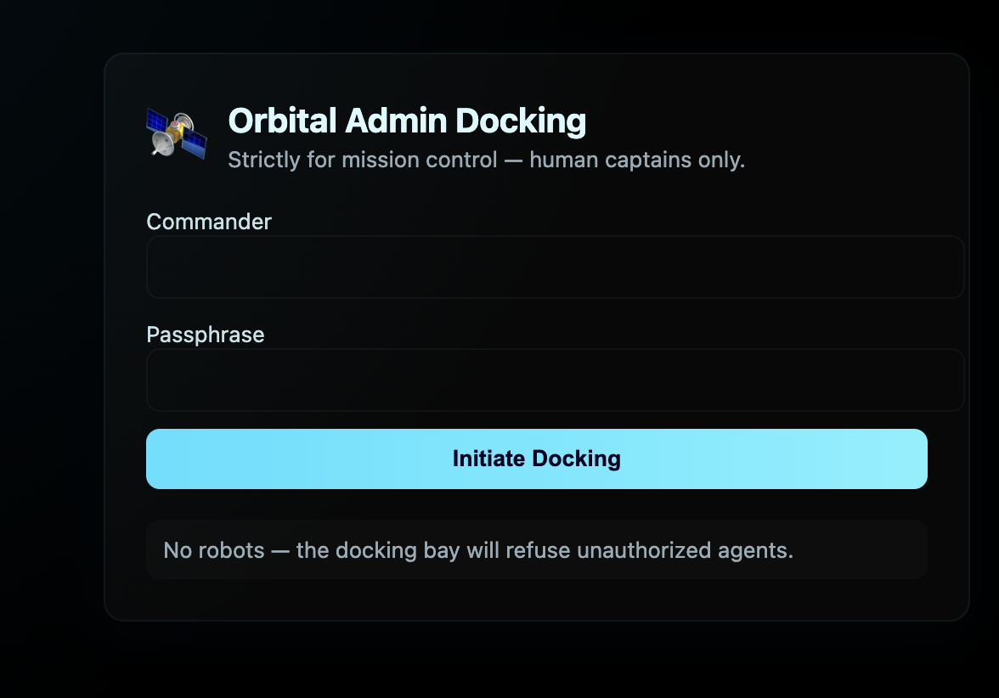

# Lunar Auth

Infiltrate the LunarAuth admin panel and gain access to the super secret FLAG artifact !

https://comet.sunshinectf.games

## Recon and Attempt


We load the website and see this page which tells us that robots are not allowed and only admins may dock. This prompted me to check for the robots.txt file:

```
# tired of these annoying search engine bots scraping the admin panel page logins:

Disallow: /admin
```

This tells me that there is a /admin page. When I directly connect to it, I see:



Inspecting the webpage, I found a client side base64 encryption in the html code provided.


We also see that they did not implement proper encryption as the username and password is right there.

```
const real_username = atob("YWxpbXVoYW1tYWRzZWN1cmVk");

const real_passwd   = atob("UzNjdXI0X1BAJCR3MFJEIQ==");
```

The atob() method decodes a base-64 encoded string.

Putting these values through cyberchef therefore grants me the credentials to the account and the flag.

