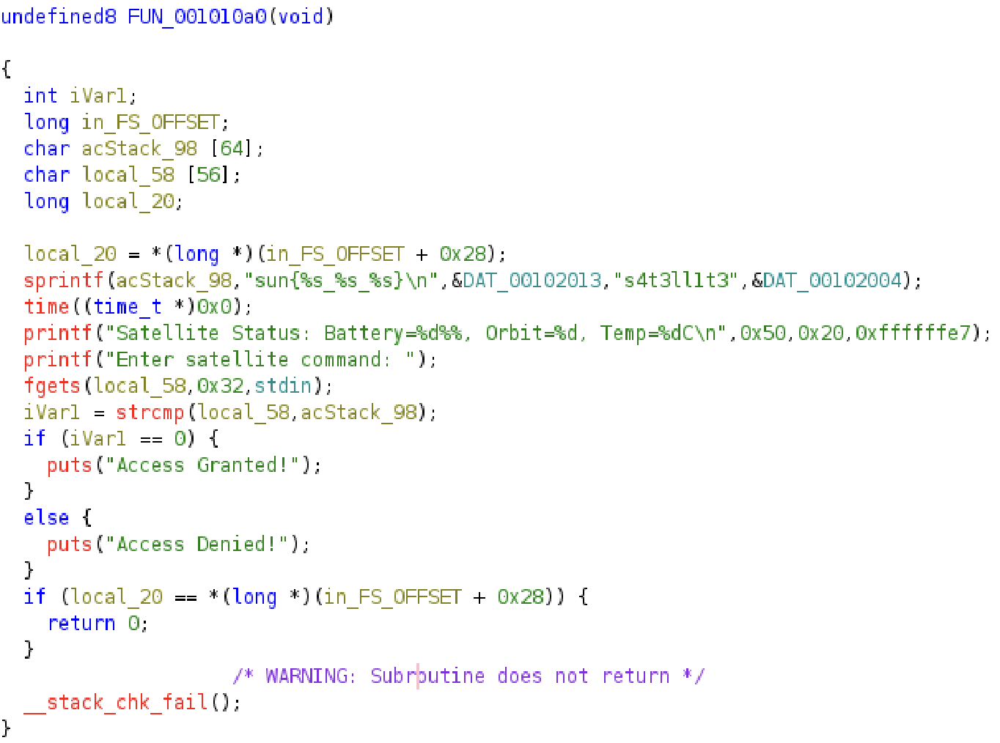
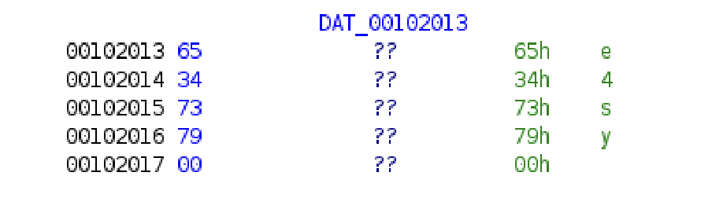

# Missioncritical1

Ground Control to Space Cadet!

We've intercepted a satellite control program but can't crack the authentication sequence. The satellite is in an optimal transmission window and ready to accept commands. Your mission: Reverse engineer the binary and find the secret command to gain access to the satellite systems.

# Attempt

> file chall

```
chall: ELF 64-bit LSB pie executable, x86-64, version 1 (SYSV), dynamically linked, interpreter /lib64/ld-linux-x86-64.so.2, BuildID[sha1]=643f888f6a846b88e61a61a180506277b41c610d, for GNU/Linux 4.4.0, stripped
```

Looking into ghidra, we see that there is a function with some noteable code.



We see that the function prints the flag `sun{%s_%s_%s}` with some input from pointers. 

Looking into the specific pointers, we see that the strings are `easy` and `3131`:




Therefore piecing them together, we can conclude that the flag is `sun{e4sy_s4t3ll1t3_3131}`.