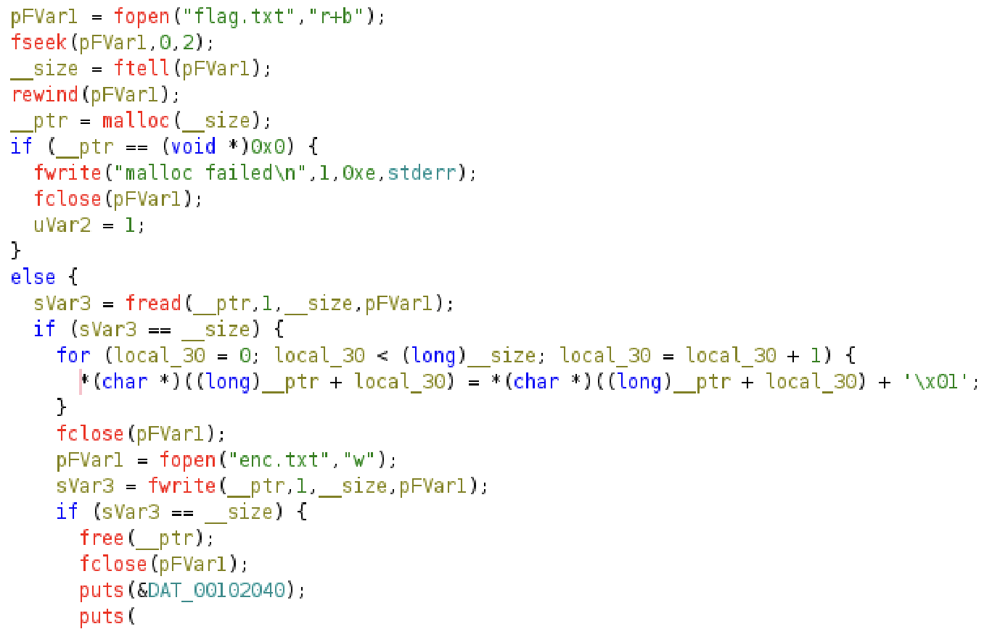

# Roman Romance

When in Rome...
> currently has nonstandard flag format sunshine{}

# Attempt

> file romanromance

```
romanromance: ELF 64-bit LSB pie executable, x86-64, version 1 (SYSV), dynamically linked, interpreter /lib64/ld-linux-x86-64.so.2, BuildID[sha1]=22691467481039a1263756b806396768fd707772, for GNU/Linux 3.2.0, not stripped
```

> cat enc.txt

```
tvotijof|lO1x`z1v5`s1nAo`iJ6u1sZ~
```

Looking into ghidra:




