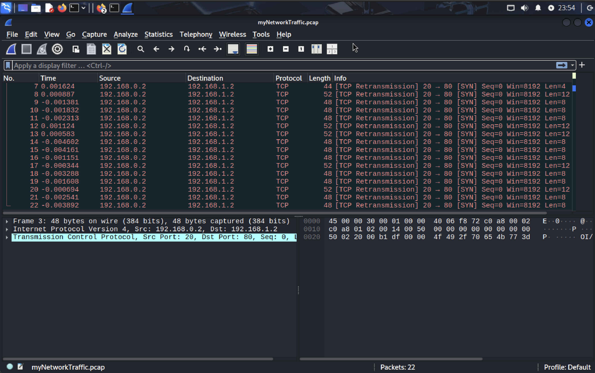
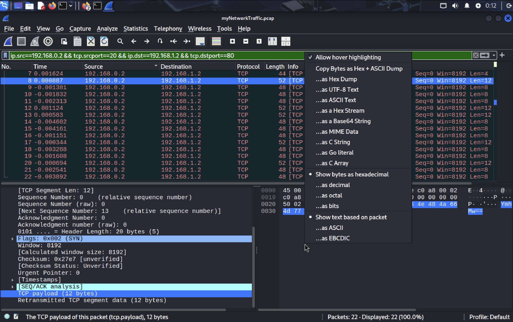
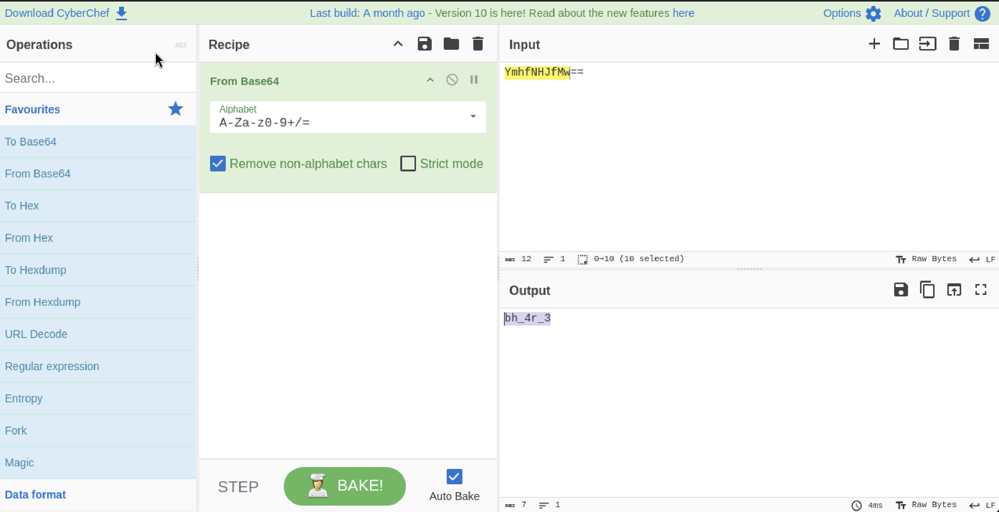
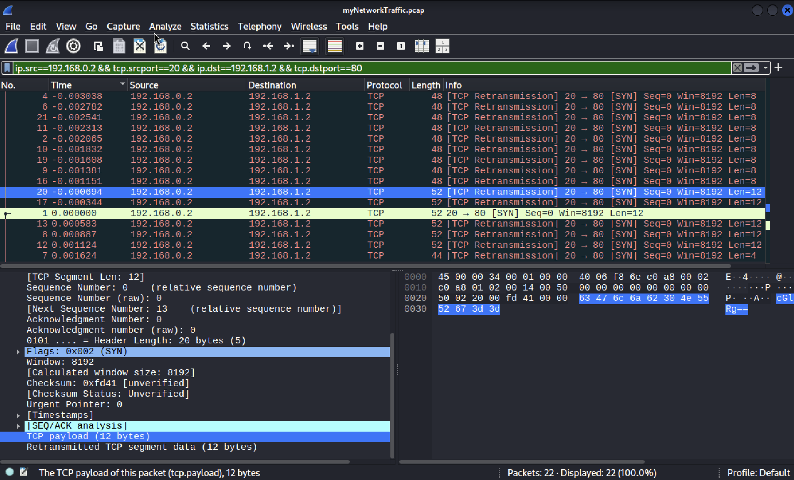
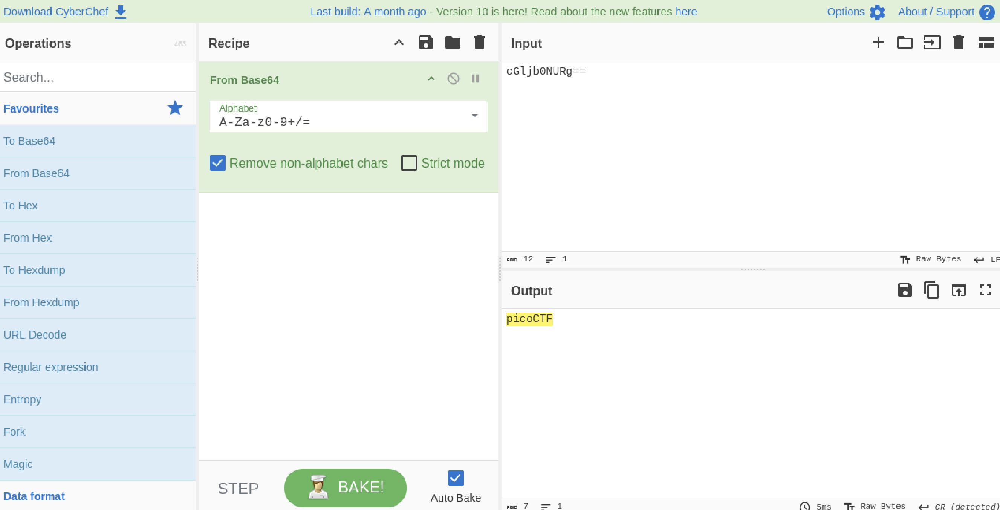

# Ph4nt0m 1ntrud3r

A digital ghost has breached my defenses, and my sensitive data has been stolen! 😱💻 Your mission is to uncover how this phantom intruder infiltrated my system and retrieve the hidden flag.  

To solve this challenge, you'll need to analyze the provided PCAP file and track down the attack method. The attacker has cleverly concealed his moves in well timely manner. Dive into the network traffic, apply the right filters and show off your forensic prowess and unmask the digital intruder!  

Find the PCAP file here [Network Traffic PCAP file](https://challenge-files.picoctf.net/c_verbal_sleep/b6fbb3a5560749f838cdc6db4950985767c4691db3a7b34a220e5654ee39e700/myNetworkTraffic.pcap) and try to get the flag.

Hints
1. Filter your packets to narrow down your search.
2. Attacks were done in timely manner.
3. Time is essential

## Attempt

[PCAP](https://www.endace.com/learn/what-is-a-pcap-file) files are ways to store packet captures. So it includes every byte of every packet captured on the network. 

To read or write a PCAP file, we can use something that is called a packet capture system. Open-source tools including _tcpdump, libPCAP, WinPCAP, NPCAP, Zeek, Snort, Suricata, Wireshark, etc_ can also do that.

So going back to this challenge, to read this file, we need to either download [Wireshark](https://www.wireshark.org/download.html) or use tcpdump in linux terminal.

Inserting this file into WireShark, I get:

Looking at the bottom left, this is where we get details on the packet. The first line is the frame section which tells us the order of the packet in which it was captured and the size.

The next section shows the network layer protocol used. There is a src and dst ip address to show who sent the packet and who received it.

The last section shows which transport layer protocol is being used.

In a TCP packet there are two parts
1. Metadata of the packet like checksums 2. Port numbers

Knowing that, we want to hover over the TCP payload option, which highlights the parts of the packet that it relates to. As you can see it is in base64, ending with == as your indicator.

We copy the byte by left clicking and copy as ASCII text. Then we paste it into cyberchef and decode it from base64

As you can see, we get something very encouraging.

Now we filter the packets by time so it is arranged chronologically and start decoding all the base64 texts.

And we get the flag!
