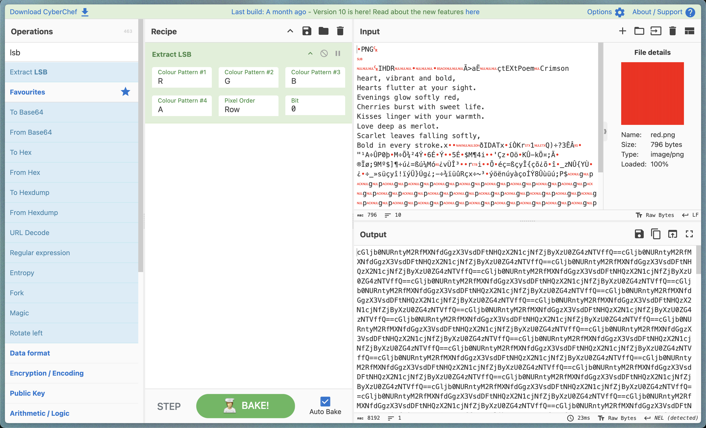
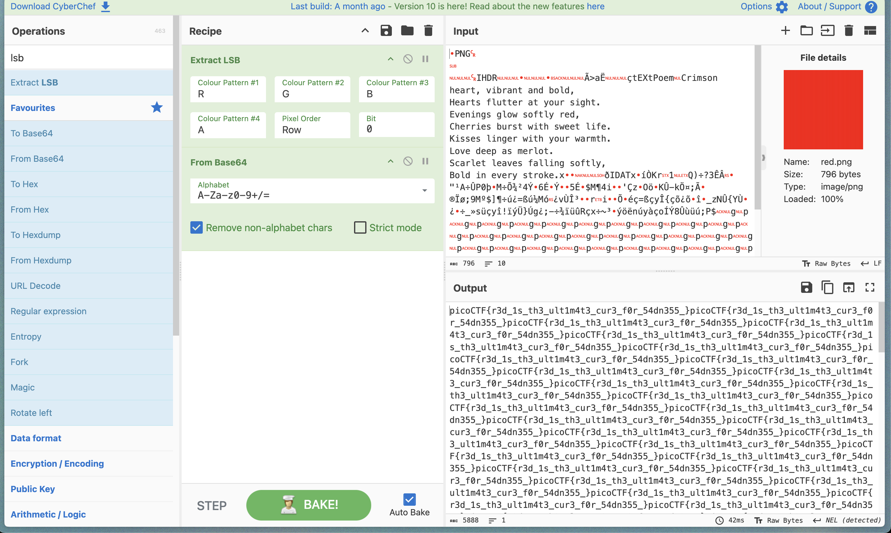

# RED
Description
RED, RED, RED, RED
Download the image: [red.png](https://challenge-files.picoctf.net/c_verbal_sleep/831307718b34193b288dde31e557484876fb84978b5818e2627e453a54aa9ba6/red.png)

Hints:  
1. The picture seems pure, but is it though?
2. Red?Ged?Bed?Aed?
3. Check whatever Facebook is called now.

The hints clearly indicate to check the metadata of the png file.

>  exiftool red.png  

>ExifTool Version Number         : 12.40  
>File Name                       : red.png  
>Directory                       : .  
>File Size                       : 796 bytes  
>File Modification Date/Time     : 2025:03:06 03:34:15+00:00  
>File Access Date/Time           : 2025:09:10 16:01:19+00:00  
>File Inode Change Date/Time     : 2025:09:10 16:00:28+00:00  
>File Permissions                : -rw-rw-r--  
>File Type                       : PNG  
>File Type Extension             : png  
>MIME Type                       : image/png  
>Image Width                     : 128  
>Image Height                    : 128  
>Bit Depth                       : 8  
>Color Type                      : RGB with Alpha  
>Compression                     : Deflate/Inflate  
>Filter                          : Adaptive  
>Interlace                       : Noninterlaced  
>Poem                            : Crimson heart, vibrant and bold,.Hearts flutter at your sight..Evenings glow softly red,.Cherries burst with sweet life..Kisses linger with your warmth..Love deep as merlot..Scarlet leaves falling softly,.Bold in every stroke.  
>Image Size                      : 128x128  
>Megapixels                      : 0.016  

This does not tell us much so we try the next obvious thing.

> strings red.png

>IHDR  
tEXtPoem  
Crimson heart, vibrant and bold,  
Hearts flutter at your sight.  
Evenings glow softly red,  
Cherries burst with sweet life.  
Kisses linger with your warmth.  
Love deep as merlot.  
Scarlet leaves falling softly,  
Bold in every stroke.x . 
IDATx  
IEND  

And you can see from the first letters "CHECKLSB"

LSB is a form of stegenography. So we can just head straight into Cyberchef to decode it.

And as you can see, it outputs
> cGljb0NURntyM2RfMXNfdGgzX3VsdDFtNHQzX2N1cjNfZjByXzU0ZG4zNTVffQ==

over and over again.

This looks like base64 as it is encoded only in ASCII characters:

> A–Z, a–z, 0–9, +, / 

Now I decode it from base64:

Voila we get the flag: 
> picoCTF{r3d_1s_th3_ult1m4t3_cur3_f0r_54dn355_}
