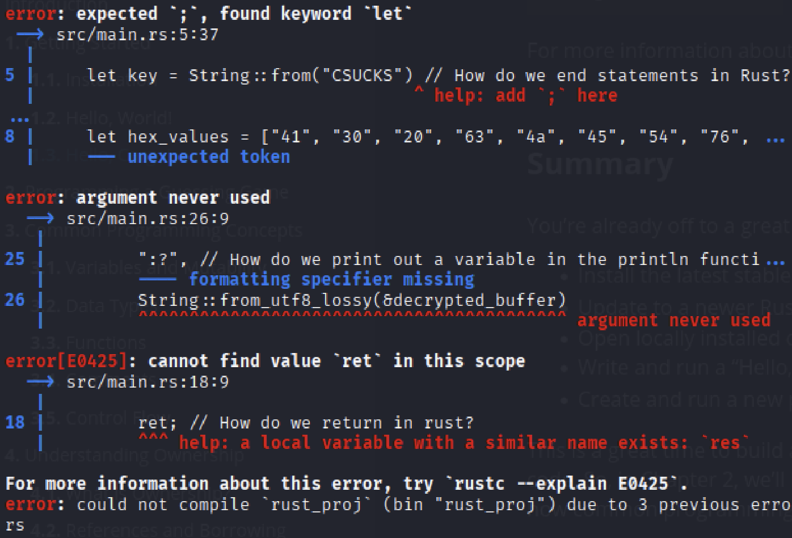

# Rust fixme 1

Have you heard of Rust? Fix the syntax errors in this Rust file to print the flag!
Download the Rust code [here](https://challenge-files.picoctf.net/c_verbal_sleep/3f0e13f541928f420d9c8c96b06d4dbf7b2fa18b15adbd457108e8c80a1f5883/fixme1.tar.gz).

Hints:
1. Cargo is Rust's package manager and will make your life easier. See the getting started page [here](https://doc.rust-lang.org/book/ch01-03-hello-cargo.html)

## Attempt

This challenge is really just trying to get us familiarised with using cargo to debug our code.

After unzipping and tar -xf the given file, we are given a directory with cargo stuff and a source code. We use _cargo check_ to look at all the stuff the program is screaming at us to fix.

> cargo check

As we can see the code has 3 main problems.

1. Did not add ; at line 5

2. Didn't use the right arguments to print variable

3. Did not return.

So lets look at each one.

2. According to the [rust documentation](https://www.programiz.com/rust/print-output), we can see that 

    > print!("{}", age); 

    using "{}" is the standard for printing variables. 

3. return;

After fixing everything we just need to run

> cargo build
>
> cargo run

This will run the rust code and give us the flag!
