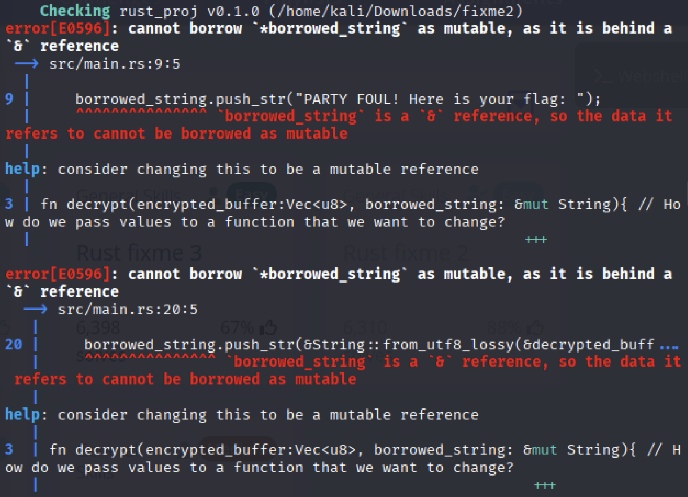
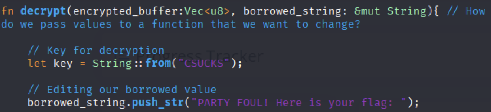
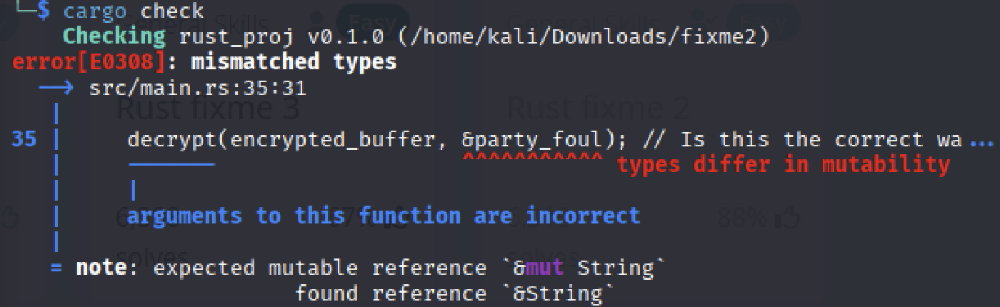
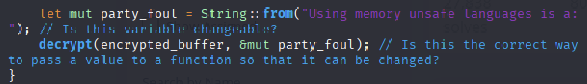
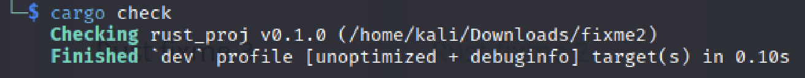

# Rust fixme 2

The Rust saga continues? I ask you, can I borrow that, pleeeeeaaaasseeeee?

Download the Rust code [here](https://challenge-files.picoctf.net/c_verbal_sleep/babfbee79718a6363826ba86300173ffde6d81577e9dd07d4130c53a7eecf6c3/fixme2.tar.gz).

## Attempt

So again we have another rust debugging challenge, so we run

>cargo check

and see what problems we are facing.

So we are facing an issue where the borrowed_string is not mutable. A great documentation to read about pass by reference and mutable strings in rust is [here](https://doc.rust-lang.org/book/ch04-02-references-and-borrowing.html).

According to the documentation, if we want to make it so that our pass by reference variable is mutable, we just have to change it to

> &mut s

Now we run cargo check again to see what the other problems are.

We can see that party foul is not mutable and we need to change it so that it is.

We check again.

Great! Now we run it and get the flag!

