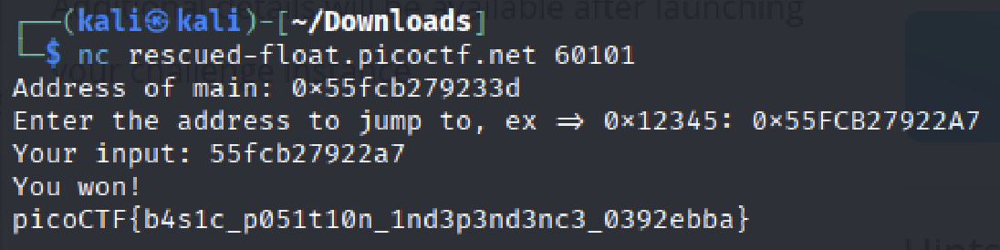

# PIE TIME

Can you try to get the flag? Beware we have PIE!

The program's source code can be downloaded [here](https://challenge-files.picoctf.net/c_rescued_float/5179d3f9719eabf4dfd93cc8d0f6e8259e74cc9f7060d63e7639868edacd5dae/vuln.c). The binary can be downloaded [here](The program's source code can be downloaded here. The binary can be downloaded here.).

Hint
1. Can you figure out what changed between the address you found locally and in the server output?

## Attempt

> nc rescued-float.picoctf.net 60133
>
>Address of main: 0x59274b21a33d  
>Enter the address to jump to, ex => 0x12345: 

### GDB

This is a very helpful assembly tool to debug your code. After installing GBD on your linux system, you can run:

> gdb ./vuln

Press CTRL-X CTRL-A to bring up the assembly or you can also type _lay next_. 

1. To only see code Press:  
Press CTRL-X together and then 1

2. To see both source and assembly  
Press 'CTRL'-'X' together and then '2'

You can also hit ENTER a few times.

To Start debugging your code:
1. gcc -o main main.c -g
2. gdb ./main
3. lay next
4. break main
5. next (jump line in c code)
6. nexti (jumpe line in assembly)
7. step (step into 'function')
8. ref (refresh layout)
9. x/i $pc (x refers to examine or view, i refers to instructions)
10. info registers

### Back to attempt

Checking the full security features of the binary:

Lets go through what every one of these means:

1. Full RELRO: Full Relocation Read-Only which makes the Global Offset Table ([GOT](https://ctf101.org/binary-exploitation/what-is-the-got/)) section read only. (We cannot overwrite win() on other function)

2. [Stack Canary](https://ctf101.org/binary-exploitation/stack-canaries/): They are a secret value placed on the stack which changes every time the program starts. It will throw an error if the value changes. (We cannot simply overwrite the stack without knowing the canary)

3. NX Enabled (No eXecute (NX Bit)): marks certain areas of the program as not executable, meaning that stored input or data cannot be executed as code.

4. PIE (Position Independent Executable) enabled: the memory is being randomly allocated each time they are executed. 

The difference between memory address remains consistent. So knowing one memory address will grant us access to the other functions in the program.

So we need to find the address of main() and the address of win() and find the difference between them. Once we have the address of main, we can apply the difference to find the address of win(). 

Doing this will let us directly call win() and get the flag!

Checking the address of main:

Checking the address of win:

Alternatively in gbb, you can also input
> disassemble main
>
> disassemble win

So we can see that main is at 0x133d and win is at 0x12a7. 

To find the difference I used a hex calculator, its 96 in hexadecimal.

Going back to the challenge, I took the address of main and minus-ed 96 from it. This should give me the win address and voila! flag.

