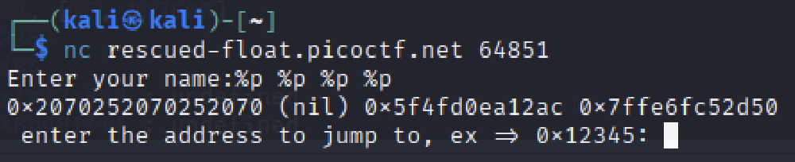
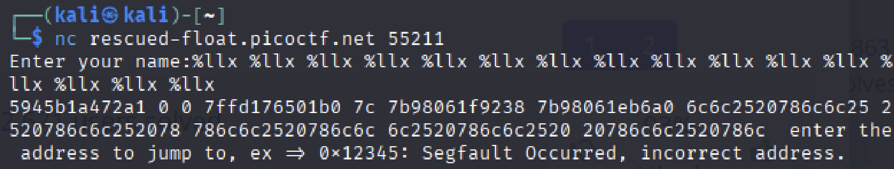
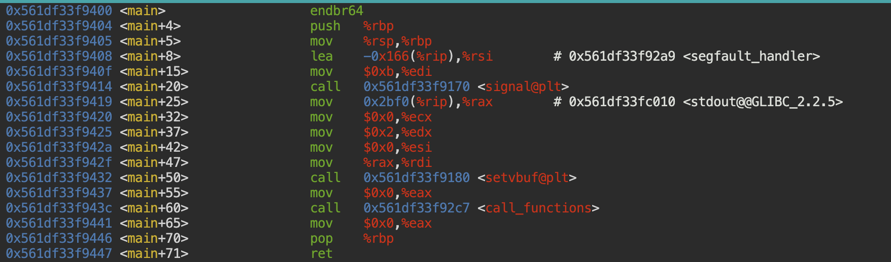
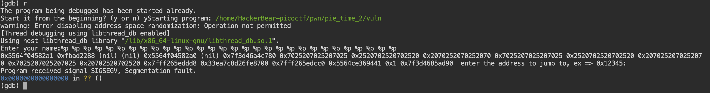
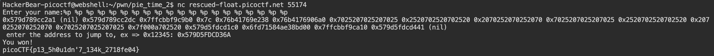

# PIE TIME 2

Can you try to get the flag? I'm not revealing anything anymore!!

Hints
1. What vulnerability can be exploited to leak the address?
2. Please be mindful of the size of pointers in this binary

## Attempt

> main: 0x1400  
> win: 0x136a  
> diff: 96

Cool thing to note, another way to find address other than the ones mentioned in Pie Time 1, is

> x/x &main

in gdb.

So now lets look at the [code](vuln.c).

```
#include <stdio.h>
#include <stdlib.h>
#include <signal.h>
#include <unistd.h>

void segfault_handler() {
  printf("Segfault Occurred, incorrect address.\n");
  exit(0);
}

void call_functions() {
  char buffer[64];
  printf("Enter your name:");
  fgets(buffer, 64, stdin);
  printf(buffer); // This should be "%s", buffer

  unsigned long val;
  printf(" enter the address to jump to, ex => 0x12345: ");
  scanf("%lx", &val);

  void (*foo)(void) = (void (*)())val;
  foo();
}

int win() {
  FILE *fptr;
  char c;

  printf("You won!\n");
  // Open file
  fptr = fopen("flag.txt", "r");
  if (fptr == NULL)
  {
      printf("Cannot open file.\n");
      exit(0);
  }

  // Read contents from file
  c = fgetc(fptr);
  while (c != EOF)
  {
      printf ("%c", c);
      c = fgetc(fptr);
  }

  printf("\n");
  fclose(fptr);
}

int main() {
  signal(SIGSEGV, segfault_handler);
  setvbuf(stdout, NULL, _IONBF, 0); // _IONBF = Unbuffered

  call_functions();
  return 0;
}
```

We can see that it is quite similar to the previous challenge but now it takes in a name and then prints the name out. However, there is an obvious bug where the %s operator is not called, and so we can exploit the program by passing %p operators.



Aha! We found a vulnerability. Now lets discuss what we are actually seeing here.

### Undefined Behaviour

In C, the program compiles even if your code produces Undefined Behaviour (UB). This means that when we call

> printf("%p");

This will print some garbage address or some random address in the register. What if we do:

> printf("%p %p %p %p");

You might expect the same output of 4 garbage values, but actually, it prints out address that are deeper in the stack. This could lead to exploitation by malicious bears!

## Back to attempt

I entered %llx instead of %x because in a 64-bit machine, %llx should be used to display the full address.

So what I am looking for now is function addresses which typically ends in '00', in this case, the main address ends in '400'.





As we can see, there are no values that matches the main address. So we try again but with %p.



Hmm looks like we did not get the main address again, but wait, one of the addresses ends with 441, that's pretty close to the main address.


Aha, so now we know where it is relative to main, main+65 in decimals, which is main+41 in hex!

So we know main is probably something400, and we know that win() is 96 away from main, so using this information, we get the flag!

