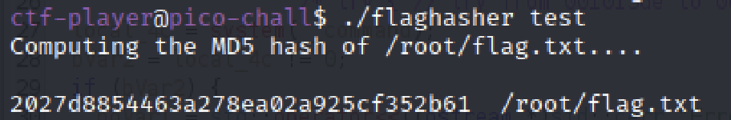
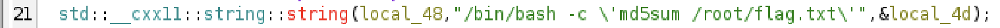

# hash-only-1

Here is a binary that has enough privilege to read the content of the flag file but will only let you know its hash. If only it could just give you the actual content!

## Attempt

We are given only the binary file, so lets run it first.

So how do we get the code without having the source code? We use Ghidra.

We can specifically see that on line 21, the program is using our local md5sum to hash the flag.

So that means that all we need to do is to change the md5sum that it is using. Ideally to read the flag.txt file.

### PATH

When we are not specifying PATH, and we want to type a command like _my_file_. It will automatically try to find an executable file _my_file_ and look into the directories in the PATH variable. Eg, /usr/bin, /bin. 

When we specify PATH= what we are doing is actually telling the shell to only search for executables in the specified directory.

## Back to Attempt

Therefore if we can change md5sum to read the text file instead of hash it and then omehow change PATH to a different directoy which contains md5sum, we will get the flag.

So with that logic lets firstly copy the cat command to our current directory and rename it to md5sum.

> cp $(which cat) md5sum

Now we just need to rerun the file but with PATH specified to current directory.

> PATH=. ./flaghasher

And we get the flag!