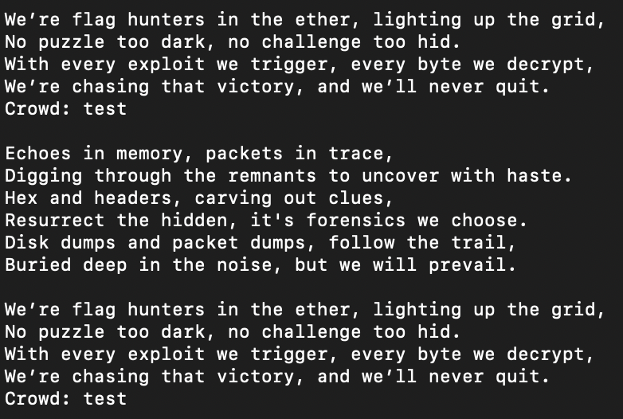
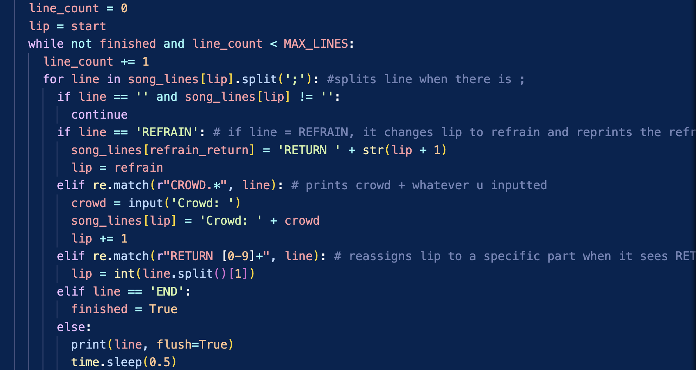
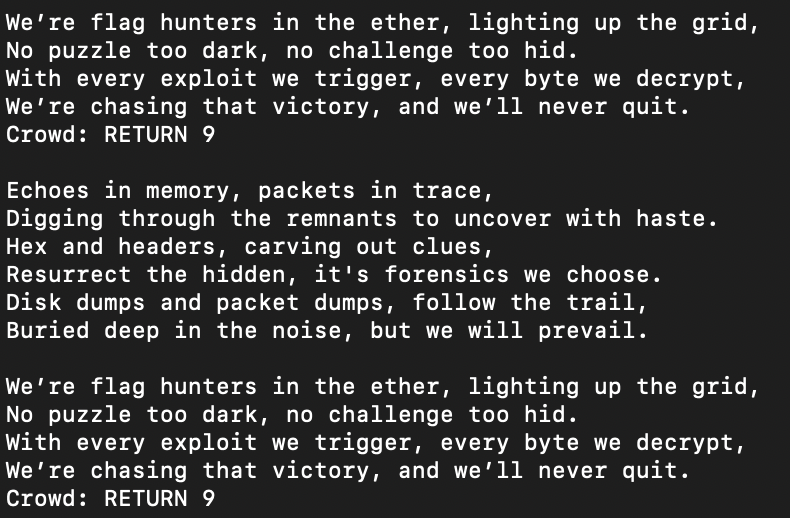
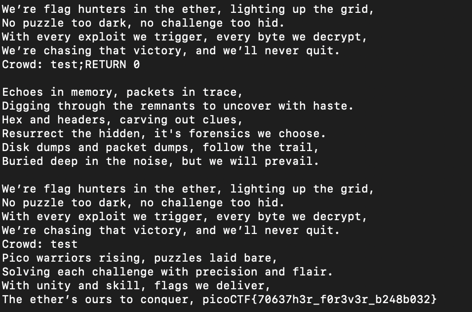

# Flag Hunters

Lyrics jump from verses to the refrain kind of like a subroutine call. There's a hidden refrain this program doesn't print by default. Can you get it to print it? There might be something in it for you.

The program's source code can be downloaded [here](https://challenge-files.picoctf.net/c_verbal_sleep/e1ff464c5a2ba5d8b318b6b906c72b1702784d5c25e8af610052b716b396dc51/lyric-reader.py).

Hints
1. This program can easily get into undefined states. Don't be shy about Ctrl-C.
2. Unsanitized user input is always good, right?
3. Is there any syntax that is ripe for subversion?

## Attempt

Looking through the [code](lyric-reader.py), I noticed that the flag is attached to one of the earlier lines, we just need to find out how to retrieve that line.

Notice how the crowd is the same after I inputted test?

Now I look into the code more carefully:

As shown in my comments, I noticed that the line splits when it sees ; in its input. There is also a section that reassigns lip to a specific part if it detects _RETURN [0-9]_, so that is probably where the flag is. 

So the issue here is that the code gets detected by the Crowd condition, so how do we bypass it. Remember how I mentioned that the line splits when it sees ; and it is using a for loop?

