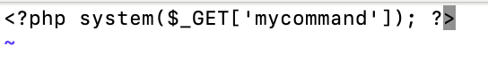

# n0s4n1ty 1

A developer has added profile picture upload functionality to a website. However, the implementation is flawed, and it presents an opportunity for you. Your mission, should you choose to accept it, is to navigate to the provided web page and locate the file upload area. Your ultimate goal is to find the hidden flag located in the /root directory. 

Additional details will be available after launching your challenge instance.

Hints
1. File upload was not sanitized
2. Whenever you get a shell on a remote machine, check sudo -l

## Attempt
The name of this challenge is called no sanity, and the description tells us that there are some issues with file uploads. We can also see from the hints that file upload was not sanitized.

So what does sanitizing file uploads mean?

It is a way of protecting your server by client side attacks. Here is a [documentation](https://cheatsheetseries.owasp.org/cheatsheets/File_Upload_Cheat_Sheet.html) on it.

So to test how vulnerable this file upload is, I created a random c file that prints hello and uploaded it.

Thats a very good sign, and it also tells us what path it takes.

You can also see that theres a php strip in the link.

And we can see the file we uploaded when trying this path

Now lets start exploiting this. I created a php file with the followig code:

We start with php tags, <?php  ?> which must be wrapped around our payload for the code to be recognised as php.

Then we use system() which executes commands directly on the server. Following that is our commands, which is the $_GET variable

Now we upload the file and insert our command.

Using the hint, we inserted sudo -l, which lists the allowed and forbbiden commands we can run with sudo under our current user account.

> Matching Defaults entries for www-data on challenge: env_reset, mail_badpass, secure_path=/usr/local/sbin\:/usr/local/bin\:/usr/sbin\:/usr/bin\:/sbin\:/bin User www-data may run the following commands on challenge: (ALL) NOPASSWD: ALL

So I know that the flag is inside /root, so I run:

> sudo ls /root

Which displays flag.txt

So I know flag.txt is in the /root directory. I will now run:

> sudo cat /root/flag.txt

And I get the flag!

> picoCTF{wh47_c4n_u_d0_wPHP_123198f1}