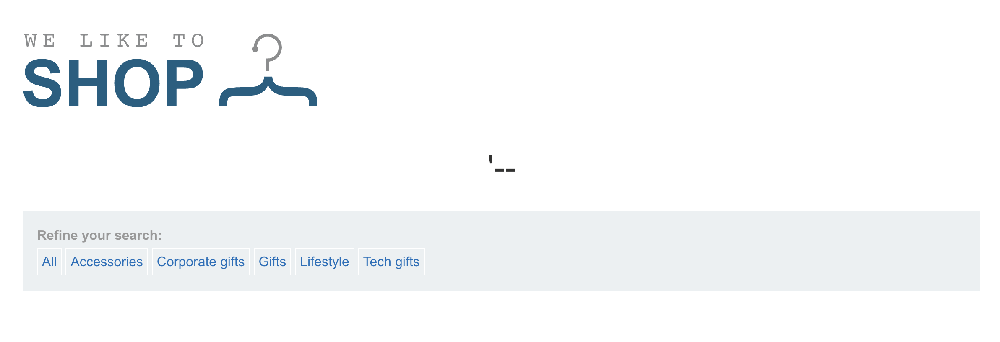
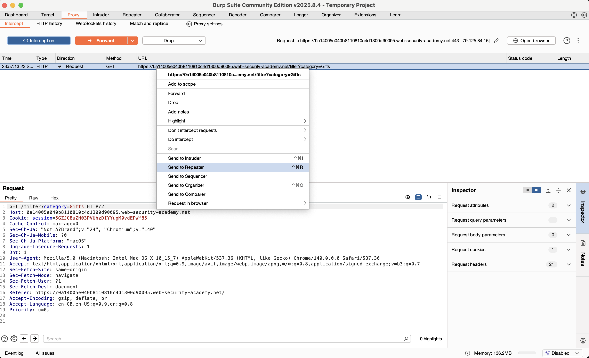
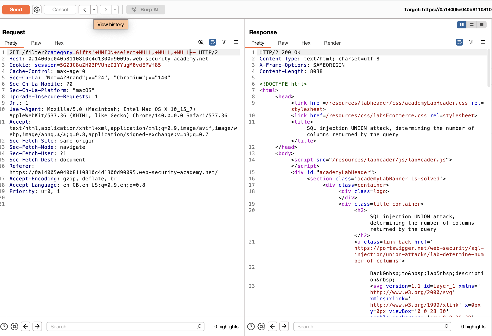
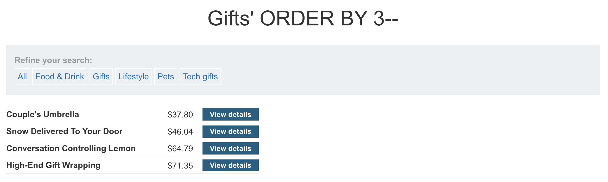

# Lab: SQL injection UNION attack, determining the number of columns returned by the query

This lab contains a SQL injection vulnerability in the product category filter. The results from the query are returned in the application's response, so you can use a UNION attack to retrieve data from other tables. The first step of such an attack is to determine the number of columns that are being returned by the query. You will then use this technique in subsequent labs to construct the full attack.

To solve the lab, determine the number of columns returned by the query by performing a SQL injection UNION attack that returns an additional row containing null values.

## Initial Recon

Testing to see if the website is vulnerable to SQL injection, I ran a single quote `'` to check for errors.

> https://0a930070041d1a3c82bee2ff001d008b.web-security-academy.net/filter?category=%27

This leads me to believe that there is a SQL injection vulnerability.

Now to confirm the vulnerability, I comment out the rest of the code

> https://0a930070041d1a3c82bee2ff001d008b.web-security-academy.net/filter?category=%27

## Attempt

There are 2 ways to solve this lab: 
1. UNION select NULL--
2. ORDER BY 1--

Lets look into both ways.

Firstly, we would like to use BurpSuite to find intercept the http request and see what result we get when we inject our SQL payload.

We send the HTTP packet to Repeater, so that we can conveniently test our payload.

We find an Internal Server Error. This is because we only inputted 1 column but the server is expecting the same number of columns as the original query. It will continue to send errors or anomalies until we get the right number of columns, so all we need to do is iterate the NULL until we do not get an error.

And we got a OK request, which tells us that there are 3 columns. 

Alternatively, we can try the ORDER BY method.

The ORDER BY method is easier to visualise as it orders the data columns. 

> https://0a14005e040b8110810c4d1300d90095.web-security-academy.net/filter?category=Gifts'+ORDER+BY+1--

This did not seem to do anything to the webpage, so it may imply that there is a hidden first column that is the item ID. 

When we increment the order to 2, we see that now the items are ordered by their names. 

When we try to order by 4, we get an Internal Server Error, so we know that there are only 3 columns in the original query.

