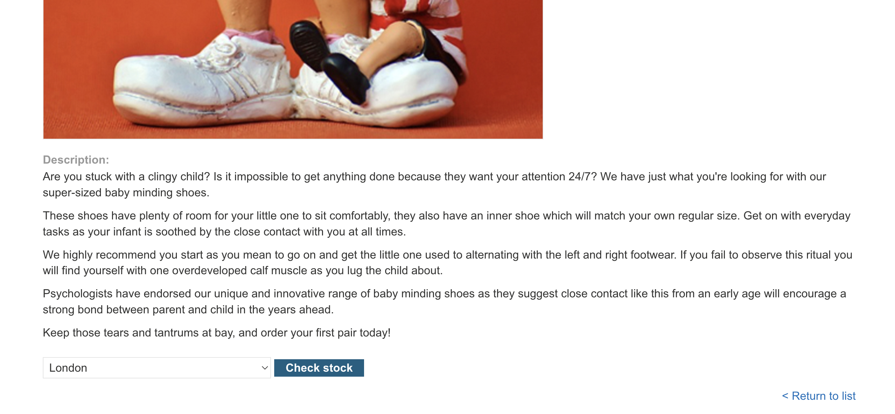
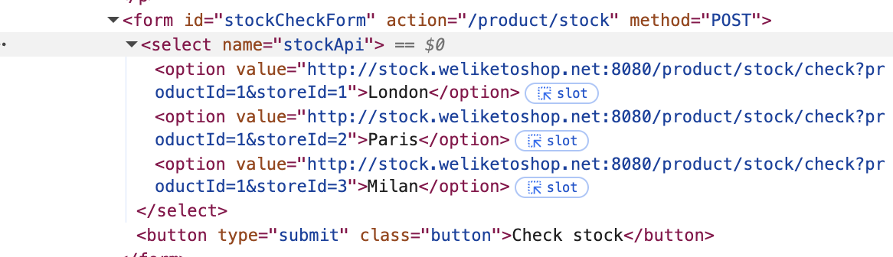
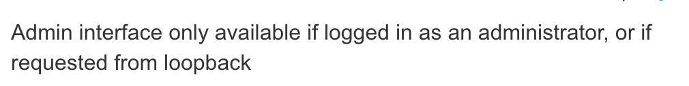
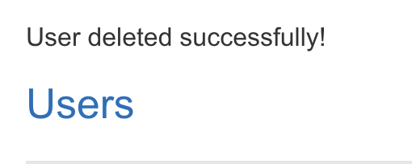

# Lab: Basic SSRF against the local server

This lab has a stock check feature which fetches data from an internal system.

To solve the lab, change the stock check URL to access the admin interface at http://localhost/admin and delete the user carlos.

## Recon

We are given a website that allows us to search for stock through a http request. Inspecting the check stock element, we see that the options have designated links.

Altering the links to `http://localhost/admin`, and making the submit request, we see the list of users.

Clicking delete here will redirect us to a page reminding us that admin interface is only available if logged in as admin. 

This means that we have to use the HTML we injected to make the request as an admin user to delete the user.

## Attempt

Crafting our payload, we want to 
1. Access localhost/admin and delete the user 

This can be done by modifying our link to make a sql deletion of the user.

> http://localhost/admin/delete?username=wiener

Taking a look again at the users through `http://localhost/admin`, we see that the user 'wiener' has been deleted.

