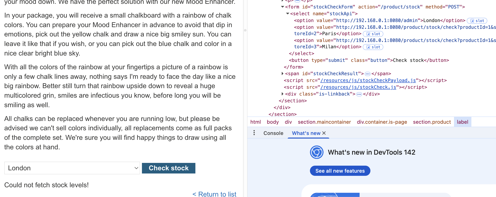
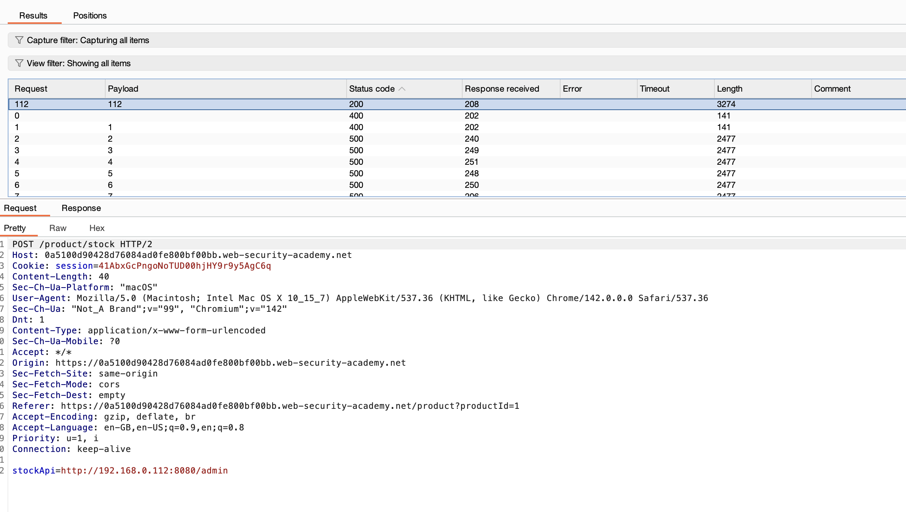
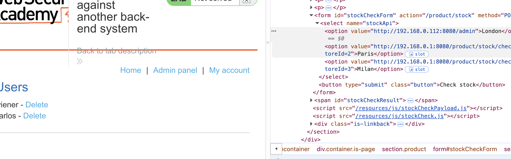
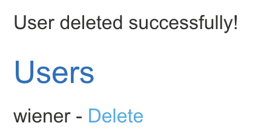

# Lab: Basic SSRF against another back-end system

This lab has a stock check feature which fetches data from an internal system.

To solve the lab, use the stock check functionality to scan the internal 192.168.0.X range for an admin interface on port 8080, then use it to delete the user carlos.

## Recon

Similar to the first lab, we do our recon accordingly.

Now we are unable to fetch anything. That is because we might not be on the right ip address to access the admin interface. 

Therefore we will need to use burp suite intruder to sweep the possible ip address and find the one that connects to the admin interface.

Now we found that the right IP address is 192.168.0.112. We can check if this works.

## Attempt

Now we can craft our payload and delete the user 'carlos'

> http://192.168.0.112:8080/admin/delete?username=carlos

Checking the users again we see that carlos has successfully been deleted.

