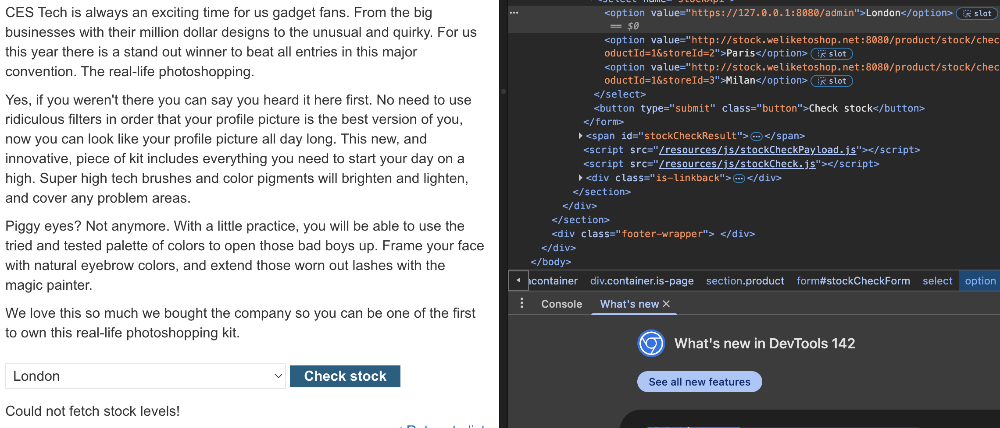
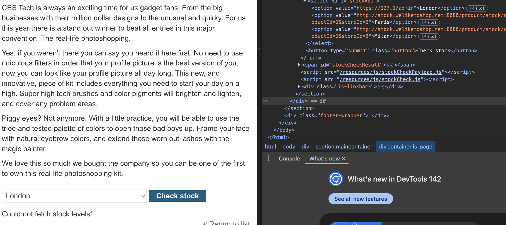

# Lab: SSRF with blacklist-based input filter

This lab has a stock check feature which fetches data from an internal system.

To solve the lab, change the stock check URL to access the admin interface at http://localhost/admin and delete the user carlos.

The developer has deployed two weak anti-SSRF defenses that you will need to bypass.

## Recon

Following the previous lab, we do the same reconning as before and test out several http links.

>http://127.0.0.1:8080/admin

We can see that this link does not work out, so we will need to change the link to bypass the SSRF defences.

We can try several ways to represent localhost or 127.0.0.1

> http://127.1/admin

