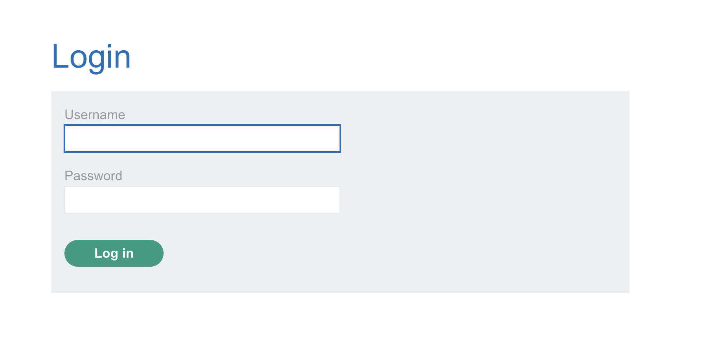

# Lab: SQL injection vulnerability allowing login bypass

This lab contains a SQL injection vulnerability in the login function.

To solve the lab, perform a SQL injection attack that logs in to the application as the **administrator** user.

## Attempt

To exploit the SQL and log into the **administrator** account, we just need to enter in the username field:

> administrator'--

It does not matter what you enter in the password as it will be commented out anyways. The SQL code will look like this:

> SELECT * FROM users WHERE username = 'administrator'--' AND password = ''

