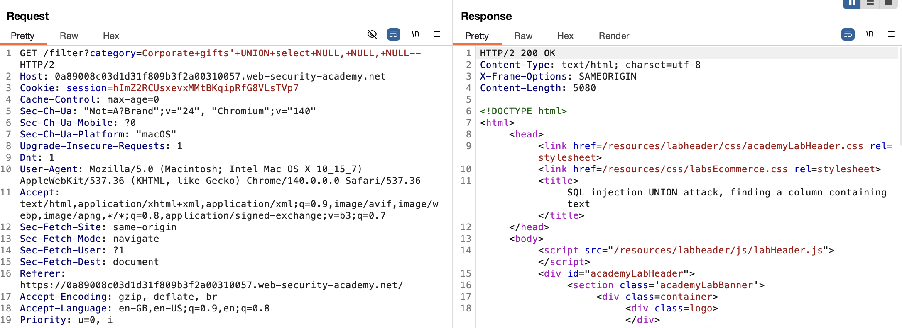
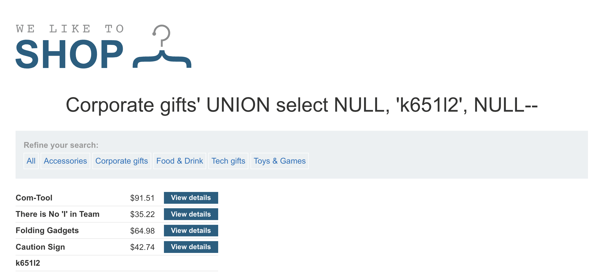

# Lab: SQL injection UNION attack, finding a column containing text

This lab contains a SQL injection vulnerability in the product category filter. The results from the query are returned in the application's response, so you can use a UNION attack to retrieve data from other tables. To construct such an attack, you first need to determine the number of columns returned by the query. You can do this using a technique you learned in a previous lab. The next step is to identify a column that is compatible with string data.

The lab will provide a random value that you need to make appear within the query results. To solve the lab, perform a SQL injection UNION attack that returns an additional row containing the value provided. This technique helps you determine which columns are compatible with string data.

## Concepts Review

On Oracle, every `SELECT` query must use the `FROM` keyword and specify a valid table. There is a built in table in Oracle called `dual` which can be used for this purpose.

> ' UNION SELECT NULL FROM DUAL--

On MySQL, the double-dash sequence must be followed by a space. Alternatively, the hash character # can be used to identify a comment.

### Finding columns with a useful data type

When we want to retrieve data from a specific data type, say strings, we need to find the columns where the data type we want is compatible with. 

After determining the number of columns we need, we can probe each column to test whether it can hold the data type we want. For example:

>' UNION SELECT 'a', NULL,NULL,NULL--  
>' UNION SELECT NULL,'a', NULL,NULL--  
>' UNION SELECT NULL,NULL,'a', NULL--  
>' UNION SELECT NULL,NULL,NULL,'a'--  

If the column data type is not compatible with string data, the injected query will cause a database error, such as:

> Conversion failed when converting the varchar value 'a' to data type int.

## Attempt

We are given the task to make the database retrieve the string: 'k651l2'

We follow the steps in the last lab to find the number of columns we need.

We find that we need 3 columns. We use the method mentioned above to test which column can hold string data type. 

We can see that the 2nd column holds it. Since the lab wants us to retrieve the string 'k651l2', we just need to change 'a' to 'k651l2'.

And we solved the lab!