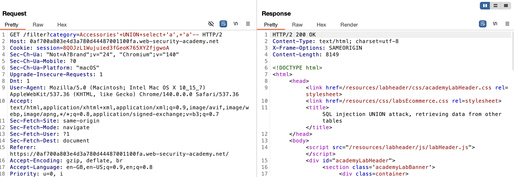

# Lab: SQL injection UNION attack, retrieving data from other tables

This lab contains a SQL injection vulnerability in the product category filter. The results from the query are returned in the application's response, so you can use a UNION attack to retrieve data from other tables. To construct such an attack, you need to combine some of the techniques you learned in previous labs.

The database contains a different table called users, with columns called username and password.

To solve the lab, perform a SQL injection UNION attack that retrieves all usernames and passwords, and use the information to log in as the administrator user.

## Conceptual Review

### Using a SQL injection UNION attack to retrieve interesting data

Now that we have learned how to identify and retrieve specific data types from UNION attacks, let's try to retrieve some interesting data!

Suppose that:
1. The original query returns two columns, both of which can hold string data.
2. The injection point is a quoted string within the WHERE clause.
3. The database contains a table called users with the columns username and password.

We can retrieve the usernames and passwords like this:

> ' UNION SELECT username, password FROM users--

However, to perform this attack, we **need** to know that there is a table called users with two columns username and password.

Without this information, you would have to guess the names of the tables and columns. All modern databases provide ways to examine the database structure, and determine what tables and columns they contain.

## Attempt

As per the previous two labs, we check the number of columns we need and whether they can hold string data types. 

Now, we use the concept mentioned above to retrieve the username and password from the user databse.

> ' UNION SELECT username, password FROM users--

We can see that it works.

And testing this on the website instead of burpsuite grants us this:

And we solved the lab!