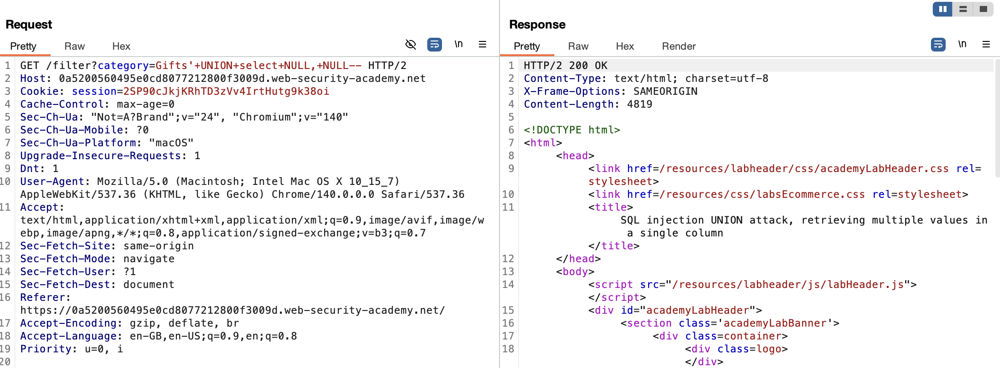
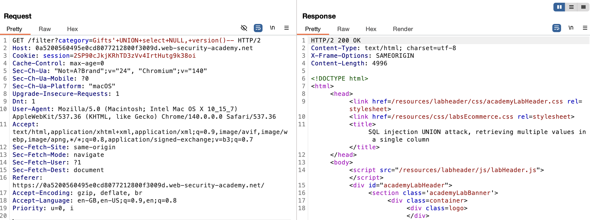
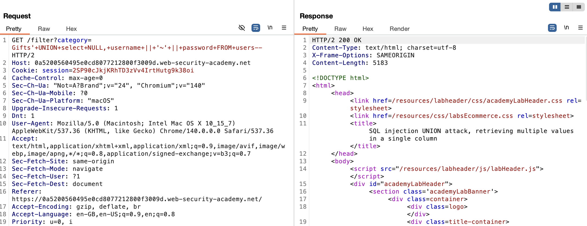
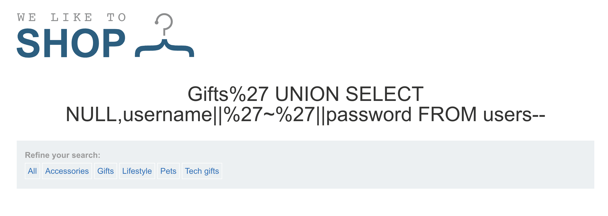

# Lab: SQL injection UNION attack, retrieving multiple values in a single column

This lab contains a SQL injection vulnerability in the product category filter. The results from the query are returned in the application's response so you can use a UNION attack to retrieve data from other tables.

The database contains a different table called users, with columns called username and password.

To solve the lab, perform a SQL injection UNION attack that retrieves all usernames and passwords, and use the information to log in as the administrator user.

## Conceptual Review

Sometimes, the query may only return a single column, so how are we supposed to return the username and password?

We can retrieve multiple values together with a single column by concatenating the values together. You can use a seperator to split the username and password to avoid confusion.

> ' UNION SELECT username || '~' || password FROM users--

This uses the double-pipe sequence `||` which is a string concatenation operator on Oracle. 

For example the results we will get looks like:

```
...
administrator~s3cure
wiener~peter
carlos~montoya
...
```

## Attempt

We recon with the tactics learnt from last lab.




Now it is important to check what database the server is using. To do so, I referred to the [cheatsheet](https://portswigger.net/web-security/sql-injection/cheat-sheet) to see which payload to use.



So now we confirmed that the databse is PostgreSQL, which means, when we want to concatenate our inputs, we use `'foo'||'bar'`.

Now we test our payload:

> ' UNION SELECT NULL, username || '~' || password FROM users--



However, when I was trying this on the lab website, it outputs differently from expected.



I have no idea why